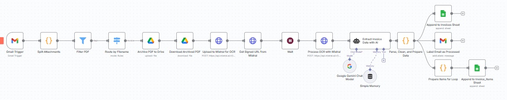
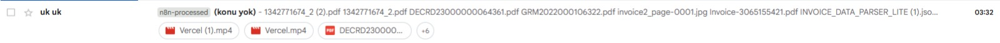
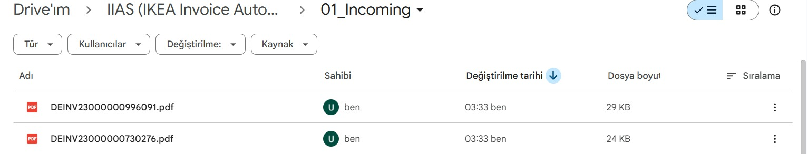
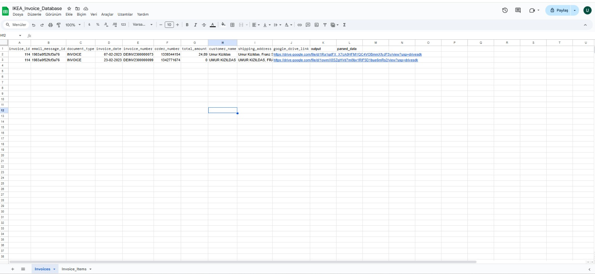
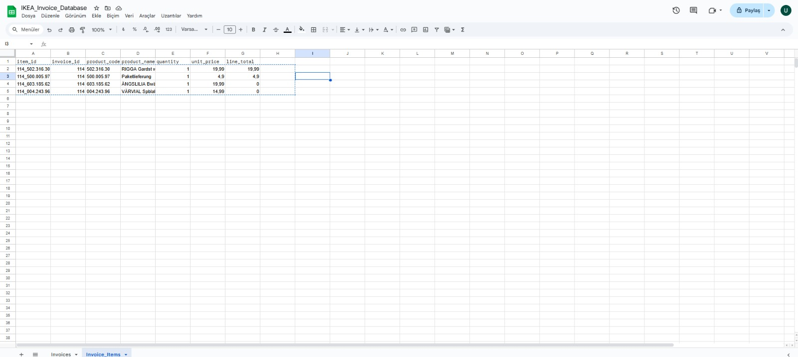

# Smart Invoice Processing Automation with n8n

This project is an end-to-end automation system built with n8n that automatically processes PDF invoices from incoming emails, parses the data, and saves it in a structured format to Google Sheets.

This system is designed to replace traditional data entry processes, saving time, minimizing human error, and making invoice data instantly available for analysis.

*A high-level overview of the workflow.*

---

## 🚀 Key Features

- **Automatic Trigger:** Checks a designated email address every minute for new, unread emails.
- **Intelligent Filtering:** Processes only PDF attachments and can target specific invoices based on file naming conventions.
- **Cloud-Based OCR:** Extracts text from PDF invoices with high accuracy using the Mistral AI API.
- **AI-Powered Data Parsing:** Leverages a Google Gemini (AI) model to analyze raw text and convert it into a structured JSON format, including an invoice summary and all line items.
- **Relational Data Recording:** Saves the parsed data to two separate, related Google Sheets tabs:
    1.  **Invoices:** Contains summary information for each invoice.
    2.  **Invoice_Items:** Lists all line items from each invoice in detail.
- **Automatic Archiving:** Archives the original PDF of every processed invoice to a dedicated Google Drive folder for future reference.
- **Feedback and Tracking:** Once a process is successfully completed, it applies a custom label (e.g., `n8n-processed`) to the original email in Gmail, providing clear status feedback.
- **Resilience:** Includes built-in wait mechanisms between critical steps to prevent API timing issues.

---

## 🛠️ Tech Stack

- **Orchestration:** [n8n.io](https://n8n.io/)
- **Email Service:** Google Gmail
- **Storage:** Google Drive
- **Database:** Google Sheets
- **OCR Service:** Mistral AI API
- **Language Model (AI):** Google Gemini API

---

## ⚙️ How the Workflow Works

This automation operates like a digital assembly line. Each node is a station that performs a specific task.

1.  **Triggering and Preparation:** The `Gmail Trigger` catches a new email. The `Filter PDF` and `Route by Filename` nodes ensure that only relevant invoices are processed.
2.  **Archiving and OCR:** The invoice is first archived to Google Drive, and then its raw data is sent to Mistral AI to extract the text.
3.  **Data Interpretation (AI):** The extracted raw text is sent to Google Gemini. Gemini analyzes the text and produces a structured JSON output containing the invoice summary and a list of line items.
4.  **Data Cleaning and Enrichment:** A custom `Code` node parses the data from the AI, cleans unwanted characters, and enriches it with metadata like a unique `invoice_id`.
5.  **Saving and Labeling:** The clean and enriched data is sent to three destinations in parallel:
    - The invoice summary is written to the `Invoices` sheet.
    - The line items are written to the `Invoice_Items` sheet.
    - The original email is labeled in Gmail.

---

## 📸 System Outputs

#### Gmail - Labeled Email
Once the process is complete, the corresponding email is automatically labeled in the inbox.

#### Google Drive - Invoice Archive
A copy of every processed PDF invoice is stored in the designated folder.

#### Google Sheets - `Invoices` Sheet
Summary information for each invoice is recorded on this sheet.

#### Google Sheets - `Invoice_Items` Sheet
Line items from each invoice are recorded here, linked by the parent invoice ID.

---

## 🚀 Setup and Usage

1.  Import the `workflow.json` file from this project into your n8n instance.
2.  Create your own API credentials for Gmail, Google Drive, Google Sheets, Mistral AI, and Google Gemini, and add them to the respective nodes.
3.  In your Gmail account, create a label to tag processed emails (e.g., `n8n-processed`) and select it in the `Label Email as Processed` node.
4.  Replace the folder and file IDs in the Google Drive and Google Sheets nodes with your own.
5.  Activate the workflow and enjoy the automation!